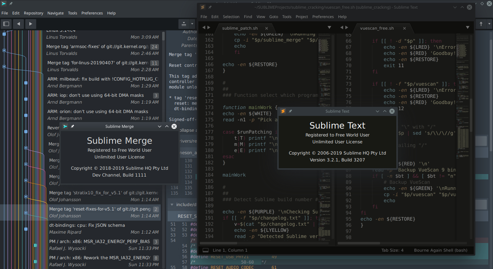

# [Script for patching Sublime Text 3, Sublime Merge](https://cipherhater.pro/sublime/)

	
<b>
		Only for builds 3207 and 1111 and only for Linux x86_64
	</b>

#### Sublime Text 3 license key required: YES (License key in patch, you can enter your name!)

#### Sublime Merge license key required: NO

---

# [Script for patching VueScan 9 x64](https://cipherhater.pro/vuescan/)

	
<b>
		Only for version v9.6.38 and only for Linux x86_64
	</b>

#### License key required: NO

---

## [Discussion and thanks here](https://gist.github.com/cipherhater/4e75d4e4551db171de03e9618456a7ea)

    
<b>
	"We do not pay for programs that you do not know how to protect..." &copy; CipherHater
    </b>

    

	Copyright &copy; 2019 CipherHater All rights reserved.
    

