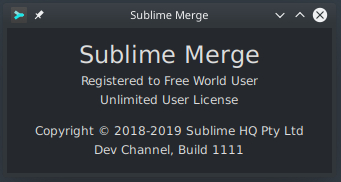

# [Script for patching Sublime Text 3, Sublime Merge]()

<center>
	<p><b>
		Only for builds 3206 and 1111 and only for Linux x86_64
	</b></p>
</center>

#### License key required: NO

---


## [Detailed explanation]()


**Automatic re-registration is triggered by the "About Sublime Text" in the program menu.**

```
If the registration is valid, then the window of the program
"Preferences -> Settings" opens in a new window, if not, then
you need to call the window "About Sublime Text" from program
menu and the registration status of the program will be resumed.

Enough to do one time.
```


**Automatic re-registration is triggered by the "About Sublime Merge" in the program menu.**

```
If the registration is valid, "Preferences -> Theme" the Dark mode
working, if not, then you need to call the window "About Sublime Merge"
from program menu and the registration status of the program will 
be resumed. 

Enough to do one time.
```



---

#### [First Step:]()
 
- [DOWNLOAD MAGIC SCRIPT](https://raw.githubusercontent.com/cipherhater/CipherHater/master/sublime_patch.sh)

 
#### How to patch the executable? Copy/Paste this script and run:

- ```$ sudo chmod +x sublime_patch.sh```
- ```$ sudo ./sublime_patch.sh```
  
---

#### [Second Step:]()

 - ```$ sudo nano /etc/hosts``` (you can use other text editor)
 - Copy & Paste

Entries to add to /etc/hosts:

```
0.0.0.0 www.sublimemerge.com
0.0.0.0 sublimemerge.com
0.0.0.0 www.sublimetext.com
0.0.0.0 sublimetext.com
0.0.0.0 sublimehq.com
0.0.0.0 telemetry.sublimehq.com
0.0.0.0 license.sublimehq.com
0.0.0.0 download.sublimetext.com
0.0.0.0 download.sublimemerge.com
```
 
 - Ctrl + w & click Enter to save file
 
---

#### [Third Step:]()
 
Add IP addresses to block, iptables command:

 - Block Host-1 - ```$ sudo iptables -A OUTPUT -d 45.55.41.223/32 -j REJECT```
 - Block Host-2 - ```$ sudo iptables -A OUTPUT -d 45.55.255.55/32 -j REJECT```
 - Block Host-3 - ```$ sudo iptables -A OUTPUT -d 209.20.83.249/32 -j REJECT```
 - Block Host-4 - ```$ sudo iptables -A OUTPUT -d 104.236.0.104/32 -j REJECT```

For Ubuntu UFW firewall script, permanent block all Sublime hosts:

```bash
#!/bin/bash
#
sudo ufw insert 1 deny out to 45.55.255.55/32 comment 'Sublime out Host-1'
sudo ufw insert 2 deny in to 45.55.255.55/32 comment 'Sublime in Host-1'
#
sudo ufw insert 3 deny out to 45.55.41.223/32 comment 'Sublime out Host-2'
sudo ufw insert 4 deny in to 45.55.41.223/32 comment 'Sublime in Host-2'
#
sudo ufw insert 5 deny out to 209.20.83.249/32 comment 'Sublime out Host-3'
sudo ufw insert 6 deny in to 209.20.83.249/32 comment 'Sublime in Host-3'
#
sudo ufw insert 7 deny out to 104.236.0.104/32 comment 'Sublime out Host-4'
sudo ufw insert 8 deny in to 104.236.0.104/32 comment 'Sublime in Host-4'
#
sudo apt install iptables-persistent
sudo dpkg-reconfigure iptables-persistent
sudo ufw status numbered verbose
#
exit 0
```

---

Run Sublime Text & appreciate the magic ^^

## [Discussion and thanks here](https://gist.github.com/cipherhater/4e75d4e4551db171de03e9618456a7ea)

## 

<center>
    <p><b>
	"We do not pay for programs that you do not know how to protect..." &copy; CipherHater
    </b></p>
</center>

<center>
    <p>
	Copyright &copy; 2019 CipherHater All rights reserved.
    </p>
</center>
